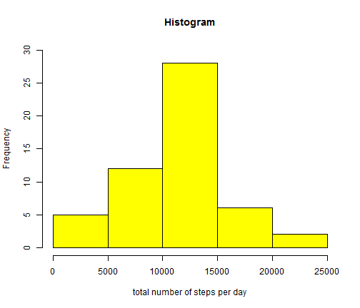
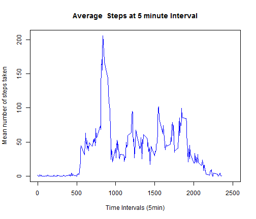
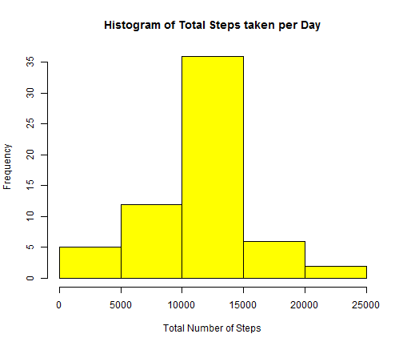
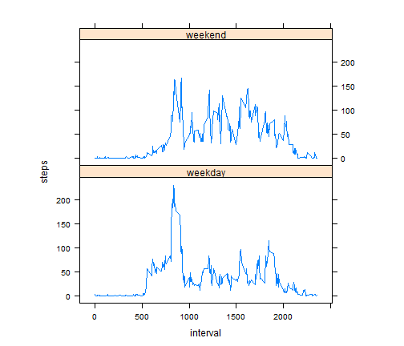

#REPRODUCIBLE RESEARCH :PEER ASSIGNMENT 1
========================================================

## Loading and preprocessing the data
1 : LOADING THE DATA


```r
activity <- read.csv("activity.csv",header=TRUE)
```

## What is mean total number of steps taken per day?
1 :HISTOGRAM OF TOTAL NUMBER OF STEPS TAKEN PER DAY


```r
aggdata<-aggregate(steps ~ date,data= activity,sum,na.rm=TRUE) 

hist(aggdata$steps,main="Histogram",col="yellow",
     xlab="total number of steps per day",ylim=c(0,30)) ## group by date
```

 

2 :THE MEAN AND MEDIAN OF TOTAL NUMBER OF STEPS TAKEN PER DAY

```r
MeanSteps <- mean(aggdata$steps)
MeanSteps 
```

```
## [1] 10766
```

```r
MedianSteps <- median(aggdata$steps)
MedianSteps 
```

```
## [1] 10765
```

## What is the average daily activity pattern?

1:TIME SRIES PLOT

```r
Step_Interval <- aggregate(steps ~ interval, data = activity, mean, na.rm = TRUE)

plot(steps ~ interval, data = Step_Interval, type = "l",  
     main = "Average  Steps at 5 minute Interval",
     xlab = "Time Intervals (5min)", ylab = "Mean number of steps taken",
     xlim=c(0,2500),col = "blue")
```

 
2: INTERVAL HAVING MAX NUMBER OF STEPS

```r
Max_Step_Interval <- Step_Interval[which.max(Step_Interval$steps), ]$interval
Max_Step_Interval
```

```
## [1] 835
```

## Imputing missing values

1: TOTAL NUMBER OF MISSING VALUES


```r
TOt_NA<- sum(is.na(activity))
TOt_NA
```

```
## [1] 2304
```
2: FILLING IN THE NA'S


```r
interval_steps <- function(interval) {
  Step_Interval[Step_Interval$interval == interval, ]$steps
}
```

3: NEW DATA SET WITH FILLED NA'S

Replacing the NA's with the average number of steps of the intervals


```r
NA_Filled <- activity
count = 0
for (i in 1:nrow(NA_Filled)) {
  if (is.na(NA_Filled[i, ]$steps)) {
    NA_Filled[i, ]$steps <- interval_steps(NA_Filled[i, ]$interval)
    count = count + 1
  }
}

sum(is.na(NA_Filled$steps))
```

```
## [1] 0
```

4.a) HISTOGRAM OF TOTAL NUMBER OF STEPS


```r
totStepsDays <- aggregate(steps ~ date, data = NA_Filled, sum)
hist(totStepsDays$steps, col = "yellow", xlab = "Total Number of Steps", 
     ylab = "Frequency", main = "Histogram of Total Steps taken per Day")
```

 

4.b) MEAN AND MEDIAN


```r
newmean<-mean(totStepsDays$steps)
newmean
```

```
## [1] 10766
```

```r
newmedian<-median(totStepsDays$steps)
newmedian
```

```
## [1] 10766
```

## Are there differences in activity patterns between weekdays and weekends?

1. CREATING NEW FACTOR VARIABLES


```r
NA_Filled$day = ifelse(as.POSIXlt(as.Date(NA_Filled$date))$wday%%6 == 
                              0, "weekend", "weekday")

NA_Filled$day = factor(NA_Filled$day, levels = c("weekday", "weekend"))
```


2. TIME SERIES PLOT

```r
steps_Intervalnew = aggregate(steps ~ interval + day, NA_Filled, mean)
library(lattice)
xyplot(steps ~ interval | factor(day), data = steps_Intervalnew, aspect = 1/2, 
       type = "l")
```

 

